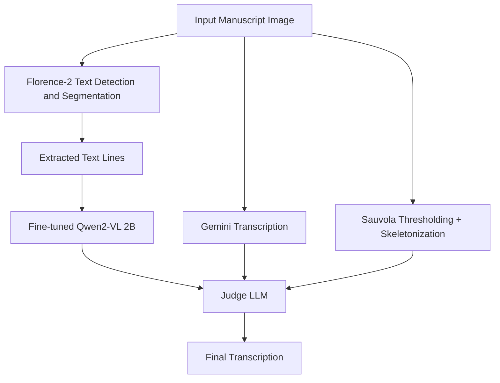

## Pipeline Overview

This project focuses on handwritten text recognition (HTR) for Early Modern Spanish manuscripts using a multi-model ensemble architecture that combines vision-language models and large language models.

### Methodology

The pipeline begins with **Florence-2**, which performs text detection and segmentation on the input manuscript image. The extracted text lines are then transcribed using a **fine-tuned Qwen2-VL (2B)** model optimized for line-level recognition.

In parallel, the original manuscript image is processed by **Gemini** using a task-specific transcription prompt. Both transcription outputs are retained for downstream verification.

To improve recognition quality, the manuscript image is additionally enhanced using **Sauvola thresholding** and **skeletonization**. The preprocessed image, along with the Qwen2-VL and Gemini predictions, is provided to a final **Judge LLM**, which resolves disagreements between models and produces the final transcription.

### Pipeline Architecture

## Evaluation Results

| Metric                     | Score |
| -------------------------- | ----- |
| Character Error Rate (CER) | 8.92% |
| BERTScore                  | 0.91  |
| Word Error Rate (WER)      | 30%   |

### Analysis

The system achieved a **CER of 8.92%** and a **BERTScore of 0.91**, indicating strong character-level accuracy and semantic similarity to the ground-truth transcriptions.

The comparatively higher **WER (30%)** is primarily caused by word-level mismatches, historical spelling variations, abbreviation expansion differences, and tokenization inconsistencies common in Early Modern Spanish manuscripts.

These results demonstrate that the proposed ensemble architecture can effectively transcribe challenging historical documents while maintaining strong semantic fidelity.
